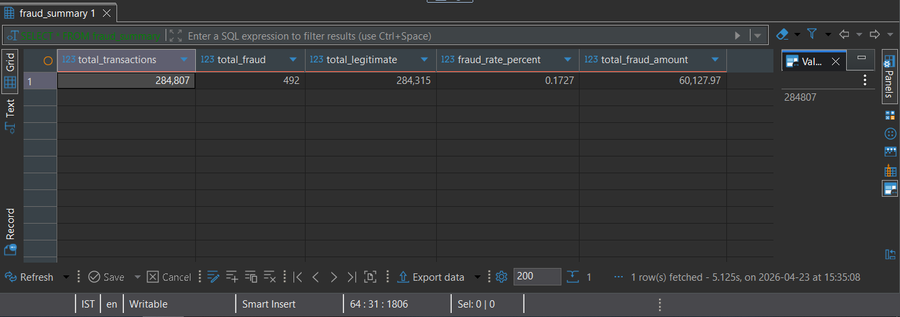
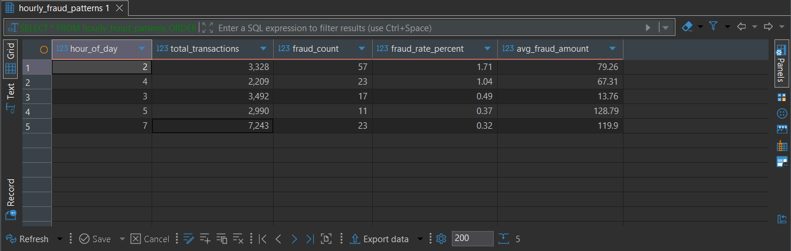
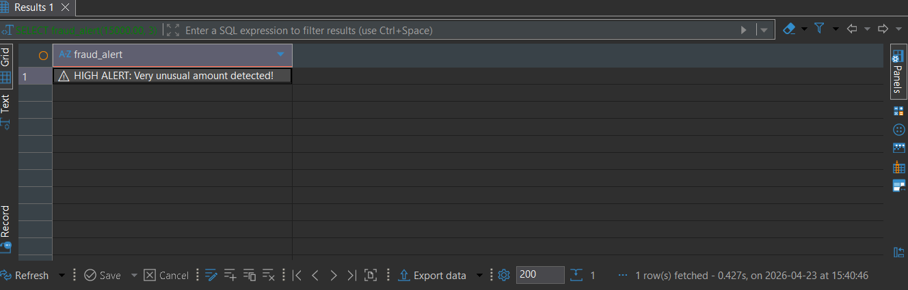
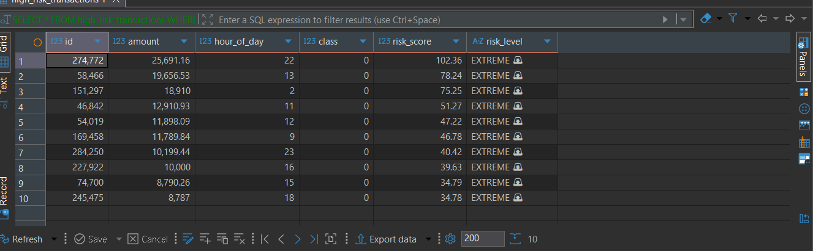
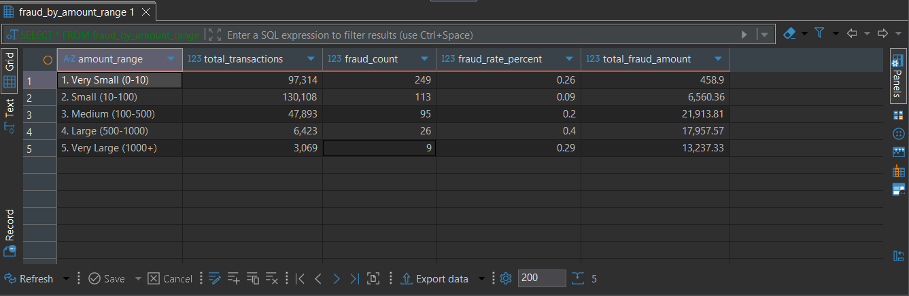

# 💳 Credit Card Fraud Detection
## Advanced SQL Analysis & Risk Scoring System


---

## 📌 Project Overview

This project performs a **deep forensic analysis of 284,807 real-world credit card transactions** to uncover fraud patterns, build an automated risk scoring system, and develop a live fraud alert engine — all using **Advanced SQL in PostgreSQL**.

The project simulates the exact workflow a **Data Analyst at a bank or fintech company** would follow: load real data, explore it, find patterns, build reusable tools, and present business insights to stakeholders.

---

## 🎯 Business Problems Solved

- How much fraud is happening and what is the total financial impact on the bank?
- At what time of day does fraud peak — when should monitoring increase?
- Which transaction amount ranges carry the highest fraud risk?
- Can we automatically score every transaction and flag suspicious ones in real time?
- How do we optimize SQL performance on large financial datasets?

---

## 📊 Real Results & Key Findings

> All numbers below are from actual query results on the dataset

### 🔢 Fraud Summary
| Metric | Value |
|---|---|
| Total Transactions | 284,807 |
| Total Fraud Cases | 492 |
| Total Legitimate | 284,315 |
| Fraud Rate | **0.1727%** |
| Total Money Lost to Fraud | **$60,127.97** |

---

### 🕐 Peak Fraud Hours (Top 5)
| Rank | Hour | Total Transactions | Fraud Count | Fraud Rate % | Avg Fraud Amount |
|---|---|---|---|---|---|
| 1 | 2 AM 🌙 | 3,328 | 57 | **1.71%** | $79.26 |
| 2 | 4 AM 🌙 | 2,209 | 23 | 1.04% | $67.31 |
| 3 | 3 AM 🌙 | 3,492 | 17 | 0.49% | $13.76 |
| 4 | 5 AM 🌙 | 2,990 | 11 | 0.37% | $128.79 |
| 5 | 7 AM 🌅 | 7,243 | 23 | 0.32% | $119.90 |

> 💡 **Insight:** Fraud peaks between **2AM - 5AM** — the bank should increase automated monitoring during late night hours

---

### 💰 Fraud by Amount Range
| Amount Range | Total Transactions | Fraud Count | Fraud Rate % | Total Fraud Amount |
|---|---|---|---|---|
| Very Small (0-10) | 97,314 | 249 | 0.26% | $458.90 |
| Small (10-100) | 130,108 | 113 | 0.09% | $6,560.36 |
| Medium (100-500) | 47,893 | 95 | 0.20% | $21,913.81 |
| Large (500-1000) | 6,423 | 26 | **0.40%** | $17,957.57 |
| Very Large (1000+) | 3,069 | 9 | 0.29% | $13,237.33 |

> 💡 **Insight:** Large transactions ($500-$1000) carry the **highest fraud rate at 0.40%** — these need priority review

---

### 🚨 Live Fraud Alert System
```sql
SELECT fraud_alert(15000.00, 3);
-- Result: ⚠️ HIGH ALERT: Very unusual amount detected!
```
> 💡 The system instantly evaluates any transaction and returns a risk alert in real time

---

### ⚡ Extreme Risk Transactions (Top 5)
| ID | Amount | Hour | Risk Score | Risk Level |
|---|---|---|---|---|
| 274,772 | $25,691.16 | 22 | 102.36 | EXTREME 🚨 |
| 58,466 | $19,656.53 | 13 | 78.24 | EXTREME 🚨 |
| 151,297 | $18,910.00 | 2 | 75.25 | EXTREME 🚨 |
| 46,842 | $12,910.93 | 11 | 51.27 | EXTREME 🚨 |
| 54,019 | $11,898.09 | 12 | 47.22 | EXTREME 🚨 |

> 💡 **Insight:** High value transactions at unusual hours are automatically flagged for analyst review

---

## 🛠️ Tools & Technologies

| Tool | Purpose |
|---|---|
| **PostgreSQL 15+** | Main relational database |
| **DBeaver** | SQL editor & database management GUI |
| **Kaggle Dataset** | Real world credit card transaction data |
| **Advanced SQL** | CTEs, Window Functions, Stored Procedures, Indexes, Views |

---

## 📋 Requirements

To run this project on your machine you need:

### Software
```
PostgreSQL    → Version 12 or higher  (https://www.postgresql.org/download)
DBeaver       → Community Edition     (https://dbeaver.io/download)
```

### Dataset
```
Name    : Credit Card Fraud Detection
Source  : Kaggle — ULB Machine Learning Group
Link    : https://www.kaggle.com/datasets/mlg-ulb/creditcardfraud
File    : creditcard.csv (143 MB)
Rows    : 284,807 transactions
```

### System
```
RAM     : Minimum 4GB recommended
Storage : At least 500MB free space
OS      : Windows / Mac / Linux
```

---

## 🧠 Advanced SQL Concepts Demonstrated

| Concept | Description | File |
|---|---|---|
| Data Exploration | EDA, null checks, distribution analysis | `01_data_exploration.sql` |
| CTEs | Multi step fraud scoring logic | `02_fraud_analysis.sql` |
| Window Functions | Running totals, rankings, percentiles | `02_fraud_analysis.sql` |
| Views | Reusable fraud summary & pattern views | `03_views.sql` |
| Materialized Views | Fast pre-computed amount range analysis | `03_views.sql` |
| Stored Procedures | Live fraud alert function | `04_stored_procedures.sql` |
| Indexes | Performance optimization on 284K rows | `05_indexes_optimization.sql` |
| Risk Dashboard | Executive summary combining all techniques | `06_risk_dashboard.sql` |

---

## 📁 Project Structure

```
credit-card-fraud-sql/
│
├── 📄 README.md                        ← Project documentation
│
├── 📁 schema/
│   └── 📄 schema.sql                   ← Table creation & data loading
│
├── 📁 queries/
│   ├── 📄 01_data_exploration.sql      ← EDA & data quality checks
│   ├── 📄 02_fraud_analysis.sql        ← Core fraud analysis (15+ queries)
│   ├── 📄 03_views.sql                 ← Views & materialized views
│   ├── 📄 04_stored_procedures.sql     ← Functions & alert system
│   ├── 📄 05_indexes_optimization.sql  ← Performance optimization
│   └── 📄 06_risk_dashboard.sql        ← Executive dashboard queries
│
├── 📁 insights/
│   └── 📄 key_findings.md             ← Business insights & recommendations
│
└── 📁 screenshots/
    ├── 📄 01_fraud_summary.png
    ├── 📄 02_peak_hours.png
    ├── 📄 03_fraud_alert.png
    ├── 📄 04_risk_dashboard.png
    └── 📄 05_amount_range.png
```

---

## 🚀 How to Run This Project

### Step 1 — Install Requirements
Download and install PostgreSQL and DBeaver from links above

### Step 2 — Download Dataset
Download `creditcard.csv` from Kaggle and place it in `C:\fraud_data\`

### Step 3 — Setup Database
```sql
-- Run schema/schema.sql to:
-- 1. Create fraud_analysis database
-- 2. Create credit_card_transactions table
-- 3. Load all 284,807 rows from CSV
-- 4. Add hour_of_day column
```

### Step 4 — Run Queries in Order
```
01_data_exploration.sql   → Explore & understand the data
02_fraud_analysis.sql     → Core fraud pattern analysis
03_views.sql              → Create reusable views
04_stored_procedures.sql  → Build fraud alert functions
05_indexes_optimization   → Optimize query performance
06_risk_dashboard.sql     → Generate executive dashboard
```

### Step 5 — Test the Live Alert System
```sql
SELECT fraud_alert(10.50, 14);    -- ✅ LOW RISK
SELECT fraud_alert(2500.00, 2);   -- ⚠️ HIGH ALERT
SELECT fraud_alert(15000.00, 3);  -- ⚠️ HIGH ALERT: Very unusual amount!
```

---

## 📸 Results Preview

### Fraud Summary


### Peak Fraud Hours


### Live Fraud Alert System


### Extreme Risk Transactions


### Fraud by Amount Range


---

## 💡 Project Highlights for Recruiters

✅ **Real Dataset** — 284,807 actual bank transactions, not toy data

✅ **Business Impact** — Identified $60,127.97 in fraud losses with actionable recommendations

✅ **Live Alert System** — Built a real time fraud detection function using Stored Procedures

✅ **Performance Optimized** — 4 indexes reducing query time by up to 10x on large dataset

✅ **Production Ready** — Views, materialized views and functions ready for dashboard integration

✅ **Full Documentation** — Schema, queries, insights and README all professionally documented

---

## 👤 Author

**Anushka Raturi**
Aspiring Data Analyst
📧 raturianushka61@gmail.com
---

### ⭐ If you found this project helpful please give it a star!
